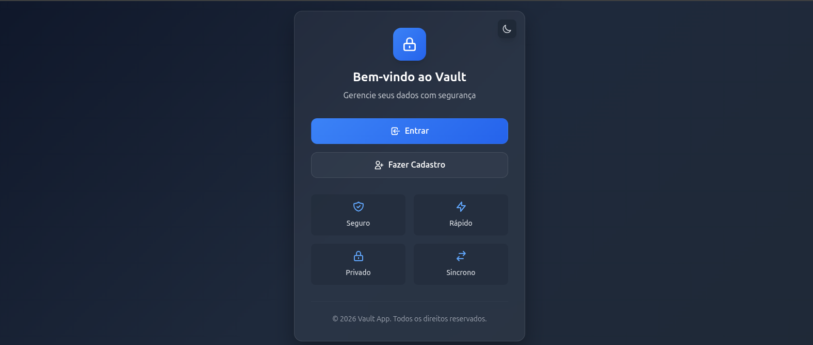
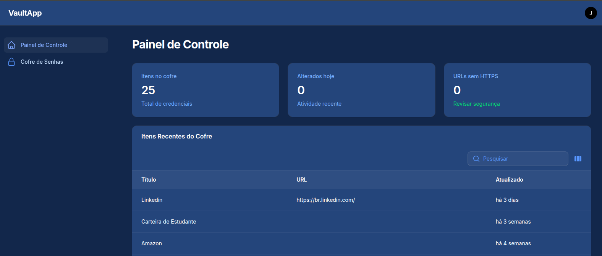

# 🔐 Vault App — Gerenciador Seguro de Credenciais

O **Vault App** é uma aplicação web desenvolvida para armazenamento seguro de credenciais, utilizando criptografia avançada e arquitetura focada em privacidade e proteção de dados.

A plataforma combina uma interface simples com um backend robusto baseado em Laravel e Filament, permitindo que usuários gerenciem informações sensíveis com segurança.

---

## 🎯 Objetivo

Criar uma solução segura para:

* armazenar credenciais sensíveis
* proteger dados com criptografia forte
* controlar acesso aos dados
* garantir privacidade por usuário

---

## ⚙️ Principais funcionalidades

### 🔐 Cofre de credenciais

* armazenamento de logins e senhas
* criptografia automática de dados
* isolamento por usuário

### 👤 Autenticação completa

* login
* registro
* redefinição de senha

### 📊 Dashboard inteligente

* estatísticas do cofre
* itens recentes
* indicadores de segurança

### ⚡ Ações rápidas

* criação de novos itens
* navegação rápida no sistema

---

## 🧠 Diferenciais técnicos

* 🔒 **Criptografia em múltiplas camadas**
* 🔑 **Derivação de chave por usuário (Argon2id)**
* 🧩 **Criptografia em envelope (data encryption key)**
* 🔐 **AES-256-GCM para dados sensíveis**
* ⏱️ **Sessão temporária para revelação de senha**
* 📊 **Validação de segurança (ex: URLs sem HTTPS)**

---

## 🏗️ Arquitetura

* **Backend:** Laravel 12
* **Admin:** Filament 4
* **Banco:** MySQL
* **Cache / Queue:** Redis
* **Infra:** Docker (Laravel Sail)

📄 Detalhes técnicos: [Arquitetura do sistema](./docs/arquitetura.md)

---

## 🔄 Fluxo de segurança

1. Usuário cria conta
2. Dados são armazenados com criptografia
3. Senhas são protegidas por chave derivada
4. Revelação exige autenticação do usuário
5. Dados são descriptografados temporariamente

---

## 📸 Demonstração

<h3 align="center">Landing Page</h3>

  

<h3 align="center">Dashboard</h3>

  

---

## 🔗 Acesso

👉 https://vault.jeancarlos.com.br/

---

## 🚧 Status

Projeto funcional com foco em segurança e evolução contínua.

---

## 👨‍💻 Autor

Jean Carlos Charão Sabino
🔗 https://jeancarlos.com.br
🔗 https://www.linkedin.com/in/jeancarloscharaosabino/
